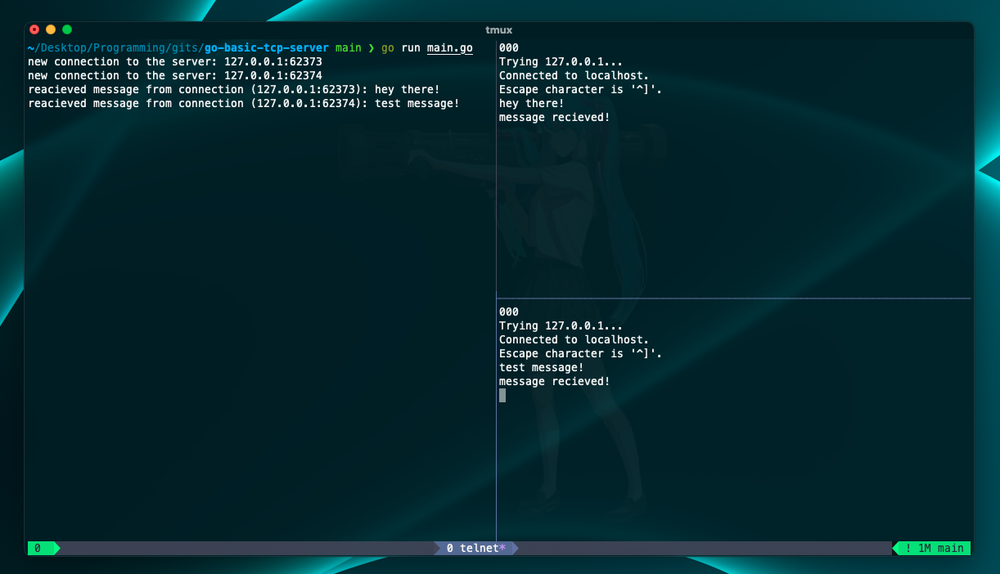

### Basic TCP Server

Custom TCP server written in Go for basic operations.

---

#### Build and run the server:

```bash
go build main.go && ./main
```

#### Test with client(s) :

On a different terminal:

1- Using `telnet`: <br>
<small>
_telnet: a client/server application protocol that provides access to virtual terminals of remote systems on local area networks or the Internet_
</small>

```bash
telnet 127.0.0.1 3000
```

2- Using `nc`: <br>
<small>_nc: networking utility for reading from and writing to network connections using TCP or UDP_</small>

```bash
nc 127.0.0.1 3000
```

then write a message and return it.

<small>On the left there is the server, on the right there are two client terminals.</small>

